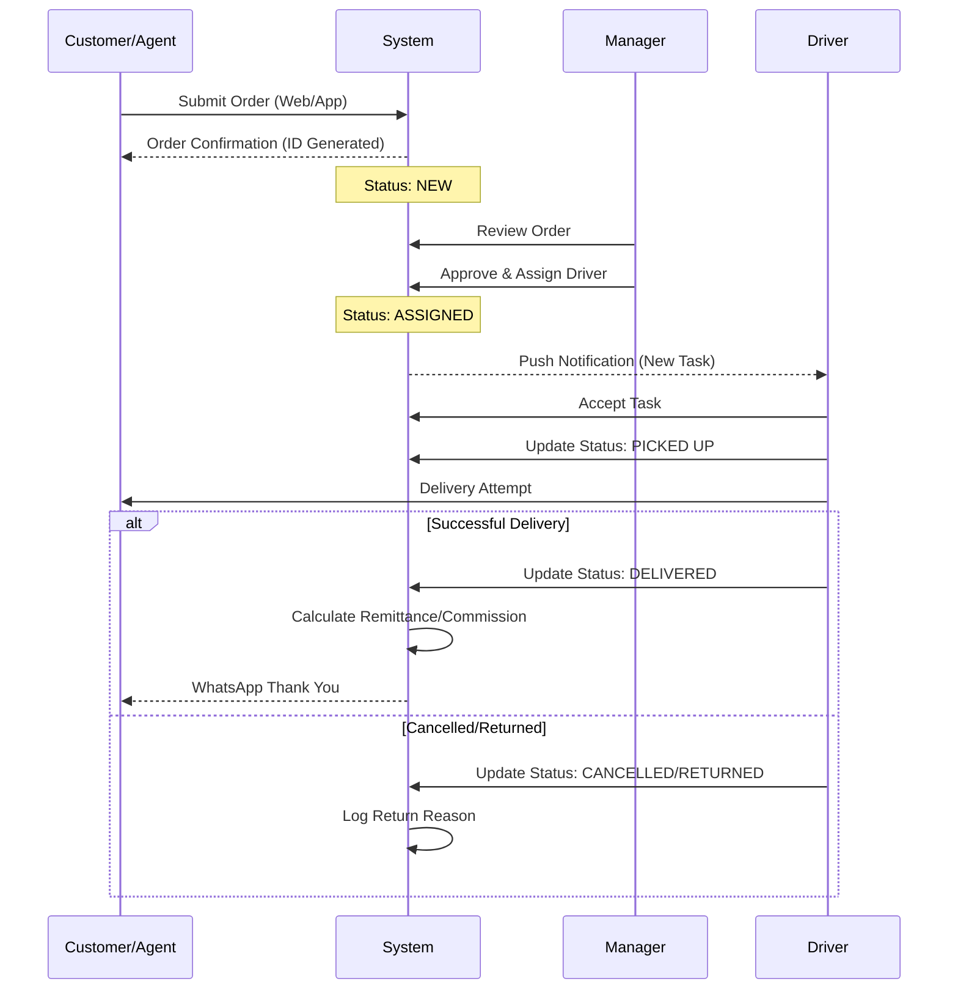

# 🌟 BuySial Management System - Complete System Flow

> [!IMPORTANT]
> **Confidential System Documentation**
> This document details the complete architectural and operational flow of the BuySial Management Platform. It is intended for internal development and system administration purposes.

---

## 🏗 System Architecture & Technology Stack

The BuySial ecosystem is built on a robust, modern MERN-stack architecture designed for high scalability, real-time performance, and cross-platform compatibility.

### **Core Technologies**

| Layer | Technology | Description |
| :--- | :--- | :--- |
| **Frontend** | **React.js + Vite** | High-performance SPA with fast hot-reloading. |
| **Mobile** | **Capacitor** | Cross-platform mobile apps (iOS & Android) from a single codebase. |
| **Styling** | **TailwindCSS** | Utility-first CSS framework for ultra-premium, responsive UI. |
| **Backend** | **Node.js + Express** | Scalable, non-blocking API server. |
| **Database** | **MongoDB** | Flexible, document-oriented NoSQL database for complex data relationships. |
| **Hosting** | **Plesk / Nginx** | Enterprise-grade hosting with reverse proxy and process management (Passenger/PM2). |
| **Authentication**| **JWT (JSON Web Tokens)** | Secure, stateless authentication for all user roles. |

---

## 🔄 High-Level System Architecture

```mermaid
graph TD
    User[End User / Customer] -->|HTTPS| CDN[CDN / Load Balancer]
    CDN -->|HTTPS| Web[Web App (React)]
    CDN -->|HTTPS| Mobile[Mobile App (Capacitor)]
    
    Web -->|API Calls| API[Backend API (Express/Node)]
    Mobile -->|API Calls| API
    
    API -->|Auth| Auth[JWT Authentication]
    API -->|Read/Write| DB[(MongoDB Database)]
    API -->|Storage| FileStore[File Uploads / Assets]
    
    subgraph "External Integrations"
        API -->|Notifications| WA[WhatsApp API]
        API -->|Payments| Pay[Payment Gateways]
        API -->|Logistics| Log[3PL Providers]
    end
```

---

## 👥 User Roles & Access Hierarchy

The system defines strict role-based access control (RBAC) to ensure security and operational efficiency.

### **1. Super Admin / User (Owner)**
*   **Access:** Full System Control.
*   **Capabilities:**
    *   Manage all users (Managers, Agents, Investors, Drivers).
    *   Real-time analytics & financial reporting.
    *   System-wide settings (Currency, Labels, Branding).
    *   Warehouse & Inventory management.

### **2. Manager**
*   **Access:** Regional / Operational Control.
*   **Capabilities:**
    *   Manage Drivers and Agents within their assigned region/country.
    *   Oversee Order Processing (Approval, Assignment).
    *   Handle Expenses & Driver Finances.
    *   View limited reports relevant to their scope.

### **3. Investor**
*   **Access:** Investment Portfolio View.
*   **Capabilities:**
    *   View invested products and their performance.
    *   Track ROI and withdraw earnings.
    *   Referral management.

### **4. Agent**
*   **Access:** Sales & Commission View.
*   **Capabilities:**
    *   Submit orders on behalf of customers.
    *   Track order status history.
    *   View earned commissions and payout history.

### **5. Driver**
*   **Access:** Logistics & Delivery App.
*   **Capabilities:**
    *   Receive assigned orders push notifications.
    *   Update statuses (Picked Up, Delivered, Cancelled).
    *   View daily earnings & collection history (COD).

### **6. Dropshipper**
*   **Access:** Reseller Panel.
*   **Capabilities:**
    *   Access product catalog with wholesale pricing.
    *   Submit orders for fulfillment.
    *   Track profit margins.

---

## 📦 Core Operational Workflows

### **1. Order Fulfillment Flow**

This is the lifeblood of the system, tracking an order from creation to final delivery.



### **2. Driver Finance & Remittance Flow**

Ensures accurate tracking of Cash on Delivery (COD) collections.

1.  **Collection**: Driver collects cash from customer upon delivery.
2.  **Tracking**: System automatically adds amount to "Driver Payable".
3.  **Remittance**:
    *   Driver physically hands cash to Manager/Company.
    *   Manager logs "Transaction" in system.
    *   Driver receives notification & digital receipt.
4.  **Settlement**: Driver's pending balance is reduced.

---

## 🎨 Design Philosophy & UX

The application adheres to an **"Ultra Premium"** design language.

*   **Color Palette**: Sophisticated darks, vibrant accents for actions, and subtle gradients.
*   **Typography**: Clean sans-serif fonts (Inter/Roboto) for maximum readability.
*   **Interactions**: Micro-animations on hover, smooth page transitions, and skeleton loading states.
*   **Responsiveness**: Mobile-first approach ensuring a native-like experience on all devices.

> [!TIP]
> **Developer Note**: When adding new features, always maintain existing component libraries and Tailwind utility patterns to ensure visual consistency.

---

## 🛠 Project Structure Overview

```text
changingbuysial/
├── backend/                 # Node.js API
│   ├── src/
│   │   ├── modules/         # Feature-based logic (Routes, Controllers, Models)
│   │   │   ├── auth/        # Authentication
│   │   │   ├── orders/      # Order Management
│   │   │   ├── products/    # Inventory
│   │   │   └── ...
│   │   └── index.js         # Entry point
│   └── public/              # Static assets
├── frontend/                # React App
│   ├── src/
│   │   ├── components/      # Reusable UI components
│   │   ├── pages/           # Route views (Admin, User, Driver panels)
│   │   ├── layout/          # Layout wrappers
│   │   └── App.jsx          # Main Router
│   ├── android/             # Native Android code
│   └── ios/                 # Native iOS code
└── readMe/                  # System Documentation
```

---

*Generated by Architecture Assist AI • 2025*
